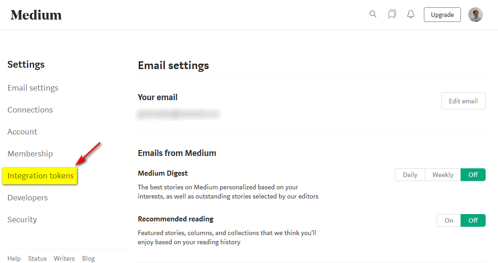
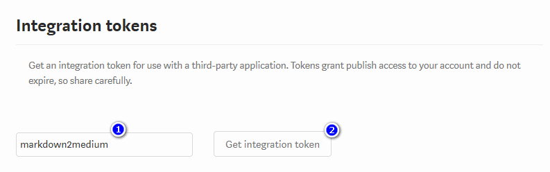
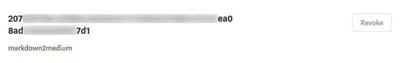

# markdown2medium
Inspired by cjoudrey/md2medium, I want a simple way to re-publish in Medium some Markdown posts written for Hugo.
This tool uploads a single post to Medium.


## Prerequisites

An Integration Token from Medium. Go to **Settings**, then **Integration tokens**.



Type something mnemonic, like _markdown2medium_ and click on **Get integration token**.



The integration token is now available until you explicitly revoke it.




## Download

For Linux
```bash
$ver = '0.1.1'
curl -L https://github.com/kpango/markdown2medium/releases/download/v${ver}/markdown2medium-${ver}-linux-x64 -o markdown2medium
chmod +x markdown2medium
./markdown2medium -h
```

For Windows
```powershell
$ver = '0.1.1'
Invoke-WebRequest https://github.com/kpango/markdown2medium/releases/download/v${ver}/markdown2medium-${ver}-win-x64.exe -OutFile markdown2medium.exe
./markdown2medium -h
```


## Usage

The options should be self-explanatory. Use `markdown2medium -h` to get the list of possible options.

At a minimum, you have to pass `--mediumIntegrationToken` (Medium authentication) and `--markdownFile` (the post to upload).
By default, the post is published as _draft_; the `--publishStatus` option allows for a _public_ or an _unlisted_ post.

`--canonicalURL` sets the URL of original post and `--originalNote` appends some Markdown at the post, typically to link back to the original post. The `--originalNote` option accepts [Go Templates](https://golang.org/pkg/text/template/) and can use these properties:

 Property       | Description
----------------|-------------
 BaseURL        | scheme and hostname of canonical URL
 CanonicalURL   | Post canonical URL as defined by `--canonicalURL` option
 Title          | Post title extracted from Front Matter
 Date           | Post date extracted from Front Matter

Use `--dryRun` to check that the input file is correct and `--debug` to dump the exact HTML that will be uploaded to Medium.


### Sample usage
```
markdown2medium                                                                                                     \
    --mediumIntegrationToken 1234567890abcdef1234567890abcdef123457890abcdef123456789abcdef1234                     \
    --markdownFile C:/myblog/content/post/2019/pyp/1-hosts/index.md                                                 \
    --canonicalURL http://blog.casavian.eu/2019/08/23/meta-pipelines-part-1-docker-hosts/                           \
    --publishStatus draft                                                                                           \
    --originalNote 'Originally posted at [{{ .BaseURL }}]({{ .CanonicalURL }}) on {{ .Date.Format \"2 Jan 2006\" }}'
```
